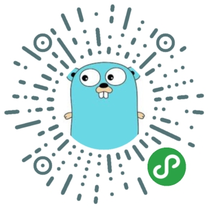

# Go By Example in Wechat miniapp
 
- [简体中文](README-zh.md)
 
This WeChat miniapp was developed using Taro + Typescript + React. Golang code examples can be browsed in WeChat miniapp.

## Use WeChat Scan Code

<p style="text-align:center;"></img><p>

## Development

```shell
# clone to local
git clone https://github.com/jackdon/gowx-miniapp.git

# yarn install npm dependency
yarn

# run
yarn dev:weapp
```
> `yarn dev: weapp` will compile the original code into small program code to` dist`, use [WeChat Developer Tools](https://developers.weixin.qq.com/miniprogram/dev/devtools/download.html) to import the project to preview
 
### Miniapp server side
Please see: [gowxapi](https://github.com/jackdon/gowxapi)

## License
- [BSD 3-Clause License](LICENSE)

